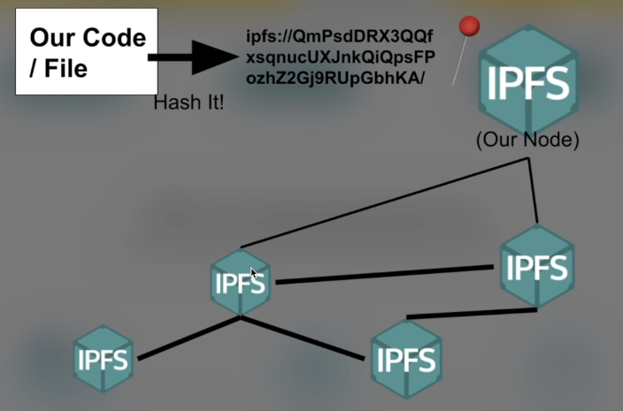

# Develop a NFT Collection Lesson Notes

### Overview of Project

This project will build my understanding of NFTs, how they are developed, best practises, low-level instructions, advanced testing and programming techniques, and so much more.

By the end of this course I will have an NFT collection that can be deployed across chains and networks. Both static and dynamic NFTs will be covered.

## What is an NFT?

NFT stands for **Non-Fungible Token** and are an ERC-721 (NFT Standard) ---> which, like ERC20, means they are a standard in place on Ethereum.

**_Non-fungible_** refers to the unique nature of each token. Unlike cryptocurrencies like Bitcoin or traditional currencies where each unit is interchangeable and identical in value (fungible) ------> (I can swap 1 dollar for another persons 1 dollar (identical) with no effects and does not lose value (identical in value)), NFTs are unique and indivisible digital assets. Each NFT has distinct properties and metadata that differentiate it from other tokens on the same platform or within the same collection.

For example, if you have two NFTs representing digital artworks, even if they are created by the same artist or belong to the same series, each token would likely have its own unique characteristics, such as a different image, timestamp, or associated metadata. This uniqueness is what makes NFTs valuable for representing ownership and provenance of digital or physical assets in a digital form.

## What is ERC-721?

It is an NFT standard in use on Ethereum that contains standardised functions, events, etc. So that across the board, we can interact with other ERC-721 adhering NFTs.

Each token ID of an ERC-721 represents a unique asset. Because of this uniqueness, we want to be able to visualise them, we need a way to define what these attributes are for the ERC-721 asset. This is where metadata and Token URIs come in.

## Where are NFTs Stored? Entirely on the blockchain in some sort of encoding?

It would be extremely costly to store and chain-intensive to encode, for example, 1000's of unique Art NFT's. Instead, most of the time a Token Uri is used. They are a unique indicator of what assets or tokens look like, and the characteristics of these tokens. A regular 'token uri' returns a format with the name, image location, description, and mentioned attributes.

A Token Uri is just a simple API Call. See the Example below:

```
{
    "name": "Name",
    "description": "Description",
    "image": "URI",
    "attributes": []
}
```

The image URI is a separate URI that points to an image.

### Metadata

Because it is so much easier and cheaper to store metadata off-chain, a lot of people use something like **IPFS**, that is decentralised but still takes come level of centrality to keep persisitng, but you can also use your own API. However, if that goes down then you lose your image, everything assosciated with your NFT.

Beacuse of this practise of using off-chain, most NFT marketplaces won't actually read metadata from on-chain because they are so used to looking for the token Uri.

Keeping things off chain makes things hard to cryptographically prove and can reduce the kind of experience you envisioned for a project. For example, if you had a creature battle game on-chain, it becomes much harder to have the creatures interact with their assigned 'attributes' if that metadata is off-chain instead of on-chain.

### URI vs URL

**URL - Uniform Resource Locator**

A URL is a type of URI that provides a means of locating a resource on a network.

**URI - Uniform Resource Identifier**

A unique sequence of characters that can be used to identify anything, including real-worl objects, including: concepts, people, information resources such as webpages or books. Some URIs are used for locating resources - URLs

While the URL can provide a resource location, a URI can identifies the resource by name at the specified location or URL.

It is an endpoint, and the tokenURI function in the ERC721 takes a uint256 tokenId as an input and returns a string of metadata - i.e. JSON formatted metadata

### What is IPFS?

IPFS stands for InterPlanetary File System. It is a protocol and network designed to create a distributed system for storing and accessing files, websites, and other data in a decentralized manner. IPFS aims to replace the traditional client-server model of the internet with a peer-to-peer model, where data is distributed across multiple nodes instead of being stored on centralized servers.

Key features of IPFS include:

**Content Addressing**: IPFS uses content-based addressing, where each piece of content is identified by a unique hash derived from its content. This means that identical content will have the same hash, enabling efficient content distribution and caching.

**Decentralization**: IPFS creates a decentralized network of nodes (peers) where each node stores a subset of the overall data. This decentralization ensures data redundancy, fault tolerance, and resistance to censorship.

**Peer-to-Peer Communication**: IPFS enables direct communication between nodes, allowing them to share and retrieve content without the need for centralized servers. Nodes can request and serve content from each other, making the network more efficient and resilient.

**Versioning and Deduplication**: IPFS supports versioning and deduplication of content, allowing multiple versions of the same content to be stored efficiently. This is achieved through the use of content addressing, where only unique content is stored once.

**Cryptographic Integrity**: Content stored on IPFS is cryptographically verified using hashes, ensuring data integrity and authenticity.

IPFS has a wide range of applications, including:

1. Hosting static websites and web applications in a decentralized manner.
2. Sharing and distributing large files, such as videos, datasets, or software packages.
3. Building decentralized applications (DApps) that require secure and reliable data storage and access.
4. Creating resilient and censorship-resistant systems for content publishing and sharing.

### Really simplied breakdown of adding image to an NFT using off-chain metadata

1. Get IPFS
2. Add tokenURI json file to IPFS
3. Add IPFS URI to your NFT URI

## Deeper Dive into IPFS

IPFS work very similiar to a blockchain in the decentralisation approach, however, there is no mining involved and rather what happens is that the IPFS nodes shares the same hashing algorithms used - and each hash is unique to that specific asset/file.

IPFS nodes are much faster and easier to set up and get running than blockchain nodes.

A big difference when compared to the blockchain is that there is no execution, there is no smart contracts. It is just decentralised storage.

So, to walk through it: 1. I have a file/code that I want to make accessible and decide upon IPFS 2. IPFS creates a hash of our file 3. The node we have pins that hashed file 4. The other nodes all talk to each other, and then someone at another node asks for the data assigned with the unique hash created before 5. The nodes then communicate until they find someone that has that hashed data. It is also possible for other nodes, besides the original to create copies of the data and pin it too --> this results in a bunch of decentralised sets of that data



### Uploading Files

The Desktop application makes the process of making public, decentralised files super easy. Simply open IPFS from the bottom menu bar and go to the files section. You will see an option to import folders or files.

Simply import the file you desire and it is done.

Once the file has been hashed and is readily available through IPFS, it will generate a CID - the hash identifier for the file.

### Accessing the File

I have the IPFS Desktop Application and the Browser Extension (called _Companion_ by IPFS).

The Desktop application has a tab called 'Explore'. This tab features a search bar where you can enter a CID and have the contents returned.

In the browser, the extension will make sure that it can detect an IPFS address and understand what to do with the CID. Instead of the URL beginning with https://, the format for the url is: `ipfs://CID_Hash` --> meaning we are looking directly at the ipfs network.

The second option is to manually enter the following into the URL bar:
`https://ipfs.io/ipfs/HASH_CID_VALUE`

This method does not require the installation of the Browser extension as the way it works is by requesting the contents from another node provider to return the contents. It relys on the ipfs.io website being up, instead of the decentralised benefit of simply using ipfs://CID
