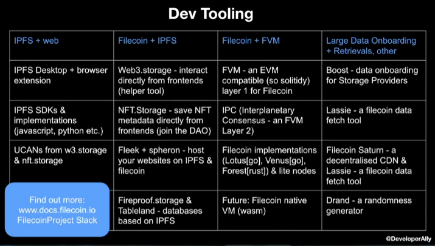
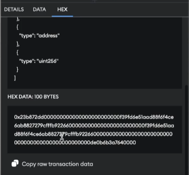
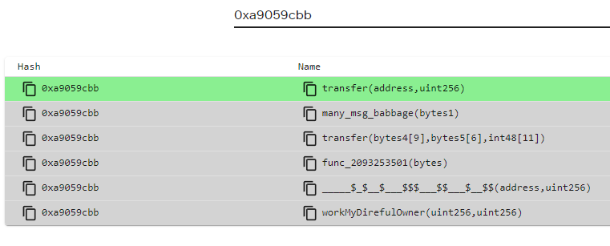

# Develop a NFT Collection Lesson Notes

### Overview of Project

This project will build my understanding of NFTs, how they are developed, best practises, low-level instructions, advanced testing and programming techniques, and so much more.

By the end of this course I will have an NFT collection that can be deployed across chains and networks. Both static and dynamic NFTs will be covered.

### Deployed NFT Contracts on Testnets

**First MoodNFT Sepolia Deployment**

You will find the deployment of the MoodNft I wrote on this course, deployed to the sepolia testnet. This [link](https://sepolia.etherscan.io/address/0xf76ed64b98bea811b05069c03d6b7204011300b5) will take you to the sepolia etherscan website, looking at my deployed version of the MoodNFT. It allows for basic interactions using sepolia connected wallets. Successfully minted and flipped the mood of said minted NFT.

## What is an NFT?

NFT stands for **Non-Fungible Token** and are an ERC-721 (NFT Standard) ---> which, like ERC20, means they are a standard in place on Ethereum.

**_Non-fungible_** refers to the unique nature of each token. Unlike cryptocurrencies like Bitcoin or traditional currencies where each unit is interchangeable and identical in value (fungible) ------> (I can swap 1 dollar for another persons 1 dollar (identical) with no effects and does not lose value (identical in value)), NFTs are unique and indivisible digital assets. Each NFT has distinct properties and metadata that differentiate it from other tokens on the same platform or within the same collection.

For example, if you have two NFTs representing digital artworks, even if they are created by the same artist or belong to the same series, each token would likely have its own unique characteristics, such as a different image, timestamp, or associated metadata. This uniqueness is what makes NFTs valuable for representing ownership and provenance of digital or physical assets in a digital form.

## What is ERC-721?

It is an NFT standard in use on Ethereum that contains standardised functions, events, etc. So that across the board, we can interact with other ERC-721 adhering NFTs.

Each token ID of an ERC-721 represents a unique asset. Because of this uniqueness, we want to be able to visualise them, we need a way to define what these attributes are for the ERC-721 asset. This is where metadata and Token URIs come in.

## Where are NFTs Stored? Entirely on the blockchain in some sort of encoding?

It would be extremely costly to store and chain-intensive to encode, for example, 1000's of unique Art NFT's. Instead, most of the time a Token Uri is used. They are a unique indicator of what assets or tokens look like, and the characteristics of these tokens. A regular 'token uri' returns a format with the name, image location, description, and mentioned attributes.

A Token Uri is just a simple API Call. See the Example below:

```
{
    "name": "Name",
    "description": "Description",
    "image": "URI",
    "attributes": []
}
```

The image URI is a separate URI that points to an image.

### Metadata

Because it is so much easier and cheaper to store metadata off-chain, a lot of people use something like **IPFS**, that is decentralised but still takes come level of centrality to keep persisitng, but you can also use your own API. However, if that goes down then you lose your image, everything assosciated with your NFT.

Beacuse of this practise of using off-chain, most NFT marketplaces won't actually read metadata from on-chain because they are so used to looking for the token Uri.

Keeping things off chain makes things hard to cryptographically prove and can reduce the kind of experience you envisioned for a project. For example, if you had a creature battle game on-chain, it becomes much harder to have the creatures interact with their assigned 'attributes' if that metadata is off-chain instead of on-chain.

### URI vs URL

**URL - Uniform Resource Locator**

A URL is a type of URI that provides a means of locating a resource on a network.

**URI - Uniform Resource Identifier**

A unique sequence of characters that can be used to identify anything, including real-worl objects, including: concepts, people, information resources such as webpages or books. Some URIs are used for locating resources - URLs

While the URL can provide a resource location, a URI can identifies the resource by name at the specified location or URL.

It is an endpoint, and the tokenURI function in the ERC721 takes a uint256 tokenId as an input and returns a string of metadata - i.e. JSON formatted metadata

### What is IPFS?

IPFS stands for InterPlanetary File System. It is a protocol and network designed to create a distributed system for storing and accessing files, websites, and other data in a decentralized manner. IPFS aims to replace the traditional client-server model of the internet with a peer-to-peer model, where data is distributed across multiple nodes instead of being stored on centralized servers.

Key features of IPFS include:

**Content Addressing**: IPFS uses content-based addressing, where each piece of content is identified by a unique hash derived from its content. This means that identical content will have the same hash, enabling efficient content distribution and caching.

**Decentralization**: IPFS creates a decentralized network of nodes (peers) where each node stores a subset of the overall data. This decentralization ensures data redundancy, fault tolerance, and resistance to censorship.

**Peer-to-Peer Communication**: IPFS enables direct communication between nodes, allowing them to share and retrieve content without the need for centralized servers. Nodes can request and serve content from each other, making the network more efficient and resilient.

**Versioning and Deduplication**: IPFS supports versioning and deduplication of content, allowing multiple versions of the same content to be stored efficiently. This is achieved through the use of content addressing, where only unique content is stored once.

**Cryptographic Integrity**: Content stored on IPFS is cryptographically verified using hashes, ensuring data integrity and authenticity.

IPFS has a wide range of applications, including:

1. Hosting static websites and web applications in a decentralized manner.
2. Sharing and distributing large files, such as videos, datasets, or software packages.
3. Building decentralized applications (DApps) that require secure and reliable data storage and access.
4. Creating resilient and censorship-resistant systems for content publishing and sharing.

### Really simplied breakdown of adding image to an NFT using off-chain metadata

1. Get IPFS
2. Add tokenURI json file to IPFS
3. Add IPFS URI to your NFT URI

## Deeper Dive into IPFS

IPFS work very similiar to a blockchain in the decentralisation approach, however, there is no mining involved and rather what happens is that the IPFS nodes shares the same hashing algorithms used - and each hash is unique to that specific asset/file.

IPFS nodes are much faster and easier to set up and get running than blockchain nodes.

A big difference when compared to the blockchain is that there is no execution, there is no smart contracts. It is just decentralised storage.

So, to walk through it: 1. I have a file/code that I want to make accessible and decide upon IPFS 2. IPFS creates a hash of our file 3. The node we have pins that hashed file 4. The other nodes all talk to each other, and then someone at another node asks for the data assigned with the unique hash created before 5. The nodes then communicate until they find someone that has that hashed data. It is also possible for other nodes, besides the original to create copies of the data and pin it too --> this results in a bunch of decentralised sets of that data


### Uploading Files

The Desktop application makes the process of making public, decentralised files super easy. Simply open IPFS from the bottom menu bar and go to the files section. You will see an option to import folders or files.

Simply import the file you desire and it is done.

Once the file has been hashed and is readily available through IPFS, it will generate a CID - the hash identifier for the file.

### Accessing the File

I have the IPFS Desktop Application and the Browser Extension (called _Companion_ by IPFS).

The Desktop application has a tab called 'Explore'. This tab features a search bar where you can enter a CID and have the contents returned.

In the browser, the extension will make sure that it can detect an IPFS address and understand what to do with the CID. Instead of the URL beginning with https://, the format for the url is: `ipfs://CID_Hash` --> meaning we are looking directly at the ipfs network.

The second option is to manually enter the following into the URL bar:
`https://ipfs.io/ipfs/HASH_CID_VALUE`

This method does not require the installation of the Browser extension as the way it works is by requesting the contents from another node provider to return the contents. It relys on the ipfs.io website being up, instead of the decentralised benefit of simply using ipfs://CID

## Comparing Strings in Solidity

Strings are a special type, essentially being dynamic arrays, therefore they can't be compared directly with '=='.

**What to do then?**

Well, there is a couple of ways of doing this:

1. Since they are arrays, we can loop and caompare at each index in the array(string) and carry out some comparison as we loop through. However, this is tedious to do and we have another option.
2. Hash each string using encoding which will always encode to a set length and makes for easy comparisons!

### Encoding/Hashing strings

**_Remember, Chisel is a great foundry tool that we can use to walk through the logic in realtime as well to ensure what we are doing makes sense_**

**Chisel Steps Comparing Strings**

1. Enter into Chisel shell

```shell
$ chisel
```

2. Create string variables to compare

```shell
➜ string memory cat = "cat";
➜ string memory dog = "dog";
```

3. View current metadata/conversion details of variables

```shell
➜ cat

Type: string
├ UTF-8: cat
├ Hex (Memory):
├─ Length ([0x00:0x20]): 0x0000000000000000000000000000000000000000000000000000000000000003
├─ Contents ([0x20:..]): 0x6361740000000000000000000000000000000000000000000000000000000000
├ Hex (Tuple Encoded):
├─ Pointer ([0x00:0x20]): 0x0000000000000000000000000000000000000000000000000000000000000020
├─ Length ([0x20:0x40]): 0x0000000000000000000000000000000000000000000000000000000000000003
└─ Contents ([0x40:..]): 0x6361740000000000000000000000000000000000000000000000000000000000

```

Right now we see it is a String object, and we can see its hex values.

4. Encode string to Bytes

We can encode strings by doing:

```shell
➜ bytes memory encodedCat = abi.encodePacked(cat);
```

5. View the metadata of the bytes encoded string

We can repeat like what we did for original string to print out its current data

```shell
➜ encodedCat
➜Type: dynamic bytes
├ Hex (Memory):
├─ Length ([0x00:0x20]): 0x0000000000000000000000000000000000000000000000000000000000000003
├─ Contents ([0x20:..]): 0x6361740000000000000000000000000000000000000000000000000000000000
├ Hex (Tuple Encoded):
├─ Pointer ([0x00:0x20]): 0x0000000000000000000000000000000000000000000000000000000000000020
├─ Length ([0x20:0x40]): 0x0000000000000000000000000000000000000000000000000000000000000003
└─ Contents ([0x40:..]): 0x6361740000000000000000000000000000000000000000000000000000000000
```

We can now see that it is of 'dynamic bytes' type.

6. Convert dynamic bytes to hashed bytes32

With the string now in dynamic bytes typing, we can hash a bytes object

```shell
➜ bytes32 catHash = keccak256(encodedCat);
```

7. View the bytes32 hash of the original string

We can now print out and look at the hash value of our string!

```shell
➜ catHash
Type: bytes32
└ Data: 0x52763589e772702fa7977a28b3cfb6ca534f0208a2b2d55f7558af664eac478a
```

**Doing this from within a solidity file**

To complete the string encoding and hashing for comparison in a smart contract, we can simply just take the individual steps that we walked through and put them into 1. Which can be used in tests using assert() type checks, or normal comparisons.

```
string public catVariable = "cat"

assert(keccak256(abi.encodePacked(contractName.functionReturnsString())) == keccak256(abi.encodePacked(catVariable)))
```

## IPFS and Pinata vs HTTP vs On-Chain SVGs

- Concerns around Websites
  - If you are using the IPFS website (not pinned decentralised method) or a normal website to host off-chain NFT meta-data, you face the consequence that if the website goes down or is unavailable, you cannot receive that metadata. Plus you wont be able to access any image that it has either.
  - To get around this, we could look at having other IPFS nodes pin our files so that it is decentralised and still able to be reached

### Pinata ---> [_Pinata Website_](https://www.pinata.cloud/)

Pinata is a leading provider in IPFS storage and are able to easily allow users to pin files across nodes, dedicated gateways, and other features too.

### SVG - Scalable Vector Graphics

Scalable Vector Graphics (SVG) is an XML-based vector image format for defining two-dimensional graphics, having support for interactivity and animation.

In regard to blockchains and NFTs, we can encode our images as SVGs and have our images ENTIRELY stored on the blockchain!

**How do we make an SVG an URI for the NFT on the blockchain?**

1. The first thing we can do is encode our SVG file into Base64.

Base64 doesn't come standard everywhere but it is a command line tool that we can use to encode our SVG into base64 format.

```shell
$ base64 -i FILENAME.svg
```

That command will return our SVG in base64 format.

2. From here, we can make browsers load images by using the following URI/URL format:

```shell
data:image/svg+xml;base64,BASE64OFOURSVG
```

**EXAMPLE**

```
data:image/svg+xml;base64,PHN2ZyB4bWxucz0iaHR0cDovL3d3dy53My5vcmcvMjAwMC9zdmciIHdpZHRoPSIxMDAiIGhlaWdodD0iMTAwIj4NCjx0ZXh0IGZpbGw9ImJsdWV2aW9sZXQiIHg9IjAiIHk9IjUwIiBmb250LXNpemU9IjEwIj4NCkhpISBUaGlzIGlzIFNWRyENCjwvdGV4dD4NCjwvc3ZnPg==
```

**_We just created a URI that we can use for our tokens!_**

And because it is code based, we can actually interact and update it with our contracts and the blockchain!

## How do we store JSON URI metadata on chain?

We can actually encode JSON objects the same we encoded SVGs - using Base64.

We can do it on chain using something like [OpenZeppelin - Base64](https://docs.openzeppelin.com/contracts/5.x/api/utils#Base64) (part of their utils packaging) to transform bytes32 data into base64 string representation.

**JSON Metadata Object**

We need to have our JSON Objects sorted and understand them before moving forward, so lets talk about that.

1. We need to know what the standard fields are required for our NFT JSON metadata:

   - name
   - description
   - attributes
     - trait types
   - image

2. Begin to structure the JSON with those fields in mind
   {
   "name": 'NAME_VARIABLE',
   "description": "DESCRIPTION OF NFT",
   "attributes": [{"trait_type": "NAME_OF_TRAIT_TYPE", "value": VALUE_OF_TRAIT}],
   "image": 'IMAGE_URI'
   }

3. With our JSON structured, we can see what we need to pass in from variables and we can begin to look at how and where we do our base64 encoding to complete the JSON object. Remembering, that we will be formatting this JSON in our contract - we can use string.concat() to help us with this but then it is still string, we can just use the abi.encodePacked() function which we have used before. There is a few ways!

   - bytes(string.concat())
   - bytes32(abi.encodePacked())

4. We also need to remember that we need the beginning of the URI base, which can't be encoded!

5. There will be a few layers of conversions and encoding, bu in the end you should have something like:

```
   string memory tokenMetadata = string( // Use string constructor to transform data from bytes to allow concatenation
            // Join base URI with rest of metadata by using abi.encodePacked() and _baseURI function
            abi.encodePacked(
                _baseURI(),
                // We can use the Open Zeppelin Base64 library to convert our bytes32 to base64
                Base64.encode(
                    // Use abi encoding inside of bytes transformer
                    bytes( // bytes casting actually unnecessary as 'abi.encodePacked()' returns a bytes
                        abi.encodePacked(
                            "{",
                            '"title": "Asset Metadata", ',
                            '"type": "object", ',
                            '"properties": {',
                            '"name": {"type": "string", "description": "',
                            name(),
                            '"}, ',
                            '"description": {"type": "string", "description": "A Moody little NFT"}, ',
                            '"attributes": [{"trait_type": "moodiness", "value": 100}], ',
                            '"image": {"type": "string", "description": "',
                            imageURI,
                            '"}',
                            "}",
                            "}"
                        )
                    )
                )
            )
        );

```

## Using Foundry Cheatcode to read files - including SVGs

vm.readFile() is a foundry cheatcode that allows us to have our Foundry project read the contents of a file. This can be very useful in our case where we want to pass in SVG files for a variety of reasons, including testing.

**_Remember to set the permissions to the required folder or root folder of the project_**

```
fs_permissions = [{ access = "read", path = "./"}]
```

OR

```
fs_permissions = [{ access = "read", path = "./broadcast"}]
```

**Reading file to string variable example**

```
string memory mySVG = vm.readFile("/path/to/file.svg")
```

## Interacting with Deployed NFT contract on Anvil

### Starting anvil chain

We can start up the anvil service by using the command:

```shell
anvil
```

The anvil blockchain service will be up and running.

We can then use accounts and private keys for those matching accounts, provided by anvil. They can be found as output in the terminal once running the above command.

### Adding anvil to metamask

We can then also add the anvil network to a developer only metamask account in a browser. Won't go into much detail, but simply go to networks - add network and populate the required fields and accounts.

### Using Foundry's 'cast'

Cast allows us to carry out interactions with deployed contracts and addresses on chains. In our case, we are wanting to interact with our deployed NFT contract.

Below is an example of calling a mint function with no input params of a deployed contract:

```shell
cast send 0x542EXAMPLEDEPLOYEDCONTRACTADDRESS213323aac "mintNft()" --private-key $ANVIL_0_PRIVATE_KEY --rpc-url http://localhost:8545
```

This example is calling a function with input params:

```shell
cast send 0x542EXAMPLEDEPLOYEDCONTRACTADDRESS213323aac "flipMood(DATATYPE)" INPUTPARAMVALUE --private-key $ANVIL_0_PRIVATE_KEY --rpc-url http://localhost:8545
```

### Foundry's 'cast call'

Using cast call can allow us to call functions of smart contracts and read any returned values.

Following on in our logic around NFTs, here is an example of wanting to see the tokenURI that is returned from the tokenURI() function.

```shell
cast call 0x542EXAMPLEDEPLOYEDCONTRACTADDRESS213323aac "tokenURI(DATATYPE) (RETURNDATATYPE)" INPUTPARAMVALUE --private-key $ANVIL_0_PRIVATE_KEY --rpc-url http://localhost:8545
```

### Importing NFT in Metamask

Copy the contract address of the deployed NFT contract.

Open the NFT tab of the Metamask that is connected and set up for the anvil chain.

Scroll down and find the 'Import NFT' option, left-click on it to launch the NFT import window.

Enter the contract address of the NFT contract into the 'Address' field.

Enter the 'Token ID' into the token id field.

Then select 'Import'.

You will now see the NFT in your metamask account!

**_IMPORTANT NOTE AS OF 27 MARCH 2024_**

I have been encountering an issue in getting the base64 encoded SVG URI image to display in Metamask using Anvil chain. Metamask correctly displays the Name of the token. JSON formatting appears corect and have validated in online formatters. The image URI displays the expected image in multiple browsers when entered into the URL bar.

Will continue to investigate, but need to crack on with course.

## Other Decentralised Storage Solutions

### NFT Storage

[NFT Storage Website](https://nft.storage/) is a website that can help you store NFT data off-chain with IPFS, as well as decentralised on Filecoin.

### Filecoin

IPFS is great, but it does not have any mechanism for storing data for any permanence or reliability guarantees. Filecoin is an internet scale, data storage blockchain for the internet (**FVM**).

FVM allows smart contract deployement and other advanced concepts to be carried out on top of the ethereum blockchain.



### Arweave

## Advanced EVM - Opcodes, calling, encoding, etc

[Solidity Docs Cheatsheet](https://docs.soliditylang.org/en/latest/cheatsheet.html)

[ABI Encoding and Decoding](https://docs.soliditylang.org/en/latest/units-and-global-variables.html#abi-encoding-and-decoding-functions)

[abi.encodePacked - Non Standard Packing](https://docs.soliditylang.org/en/latest/abi-spec.html#abi-packed-mode)

### Transaction Structure for help with following components

Transactions have a structure of:

- Nonce: tx count for the account
- Gas Price: price per unit of gas (in wei)
- Gas limit: max gas this tx can use
- To: address the tx is sent to (in case of contract deployment, this will be Null)
- Value: amount of wei to send
- Data: what to send to the To address (in case of contract deployment, this will be the binary of our smart contract -> contract init code and contract bytecode)
- v, r, s: components of tx signature

### Solidity Compiler Outputs - Binary and bytecode

When we compile our solidity smart contracts for the EVM, the compiler will provide us with two files:

- contract.abi

  - "ABIs are application binary interfaces. They define the methods and variables that are available in a smart contract and which we can use to interact with that smart contract. Since smart contracts are converted into bytecode before they get deployed to the blockchain, we need a way to know what operations and interactions we can initiate with them, and we need a standardized way to express those interfaces so that any programming language can be used to interact with smart contracts. While JavaScript is the most commonly used language for interacting with smart contracts (mainly because JavaScript is a frontend browser language and we often use frontend web pages to interact with smart contracts), you can interact with a smart contract using any coding language as long as you have the ABI for that smart contract and a library to help you communicate with any one node to give you an entry point into the Ethereum network." - https://blog.chain.link/what-are-abi-and-bytecode-in-solidity/

- contract.bin (binary)
  - This is a bunch of hexadecimal values and is what is actually put on the block chain. It is the smart contract itself! The low level stuff
  - This binary becomes the 'data' component of a Transaction on EVM!
  - Transactions have a structure of:
    - Nonce: tx count for the account
    - Gas Price: price per unit of gas (in wei)
    - Gas limit: max gas this tx can use
    - To: address the tx is sent to (in case of contract deployment, this will be Null)
    - Value: amount of wei to send
    - Data: what to send to the To address (in case of contract deployment, this will be the binary of our smart contract -> contract init code and contract bytecode)
    - v, r, s: components of tx signature

### How does Ethereum understand the bytcode/binary?

Opcodes are like the alphabet used to understand the binary we produce for our smart contract.

Each section of the bytecode represents instructions for the ethereum virtual machine to carry out and and to make our contract happen. See [evm.codes](https://www.evm.codes/) to see what the opcodes look like and what they do, plus how much gas is used for each opcode!

"Each instruction step is an operation which is referred to as “opcodes,” which are typically one-byte (eight-bits) long. This is why they’re called “bytecode”—one-byte opcodes." - https://blog.chain.link/what-are-abi-and-bytecode-in-solidity/

So, the EVM will look through the bytecode for opcodes.

### What's this got to do with abi.encode() and abi.encodePacked()?

Well, abi.encode() and abi.encodePacked() is a non-standard way of generating/encoding stuff into the binary format we've just been discussing.

We can just about encode anything we want to be in that binary/bytecode format.

### What's the difference between abi.encode() and abi.encodePacked()?

[Solidity Docs Cheatsheet](https://docs.soliditylang.org/en/latest/cheatsheet.html)

[abi.encodePacked - Non Standard Packing](https://docs.soliditylang.org/en/latest/abi-spec.html#abi-packed-mode)

In the Encoding.sol file, you can see that when we encode the string using abi.encode() it returns a big object of binary converted string:

```
 bytes memory myString = abi.encode("Hey mum, i'm learning solidity and the EVM!");
        //0: bytes: 0x0000000000000000000000000000000000000000000000000000000000000020000000000000000000000000000000000000000000000000000000000000002b486579206d756d2c2069276d206c6561726e696e6720736f6c696469747920616e64207468652045564d21000000000000000000000000000000000000000000
```

Well, notice _ALL_ the zeroes there?! Well that is all storage space being taken up!

If we don't need a perfect form of binary/bytecode representation, then we can use abi.encodePacked(). It acts sort of like a compressor, its the encode function but it compresses stuff.

```
bytes memory myStringPacked = abi.encodePacked("Hey mum, i'm learning solidity and the EVM!");
        //The returned imprefect binary/bytecode value is much more compact!
        //0: bytes: 0x486579206d756d2c2069276d206c6561726e696e6720736f6c696469747920616e64207468652045564d21
```

See how much we just compressed it?! This means we have saved the amount of storage used, and also saved on gas fees.

Actually, this abi.encodePacked() is very similiar to a concept that we have covered a lot - **type casting**.

We can see how similiar our result is here when using type casting:

```
bytes memory myStringBytes = bytes("Hey mum, i'm learning solidity and the EVM!");
        //0: bytes: 0x486579206d756d2c2069276d206c6561726e696e6720736f6c696469747920616e64207468652045564d21
```

It's important to note that in this example we are seeing the same result, however, behind the scenes they are doing different things to get their results. For further reading, check out [Open Zeppelin encodepacked vs bytes(string)](https://forum.openzeppelin.com/t/difference-between-abi-encodepacked-string-and-bytes-string/11837)

### We've encoded, but what about decoding?

[Solidity Docs Cheatsheet](https://docs.soliditylang.org/en/latest/cheatsheet.html)

Just like how the abi encoding functions are global and allow us to encode things, there is also an abi.decode function!

the abi.decode function takes 2 input params:

1. the encoded data
2. Selected type to decode the data into - e.g string

**abi.decode(encodedData,(string))**

```
string memory someDecodedString = abi.decode(encodeString(), (string));
        //0: string: Hey mum, i'm learning solidity and the EVM!
```

### Multi Encoding and decoding

We can actually encode multiple things together by simply just supplying the things we want to encode together.

```
bytes memory myMultiEncodedString = abi.encode(
            "I'm string 1",
            "I am string number 2"
        );
        //0: bytes: 0x00000000000000000000000000000000000000000000000000000000000000400000000000000000000000000000000000000000000000000000000000000080000000000000000000000000000000000000000000000000000000000000000c49276d20737472696e672031000000000000000000000000000000000000000000000000000000000000000000000000000000000000000000000000000000144920616d20737472696e67206e756d6265722032000000000000000000000000
```

We can then also conduct multi decoding by passing in what types we want the splitted decoded values to be. Very similar to single param decoding.

```
(
    string memory firstDecodedString,
    string memory secondDecodedString
) = abi.decode(multiEncode(), (string, string));
//0: string: I'm string 1
//1: string: I am string number 2
```

### Can't use abi.decode() for abi.encodePacked() values - What can be done then?

Because the packed function acts like a compressor and is not normal encoding, the decode function does not work and Solidity doesn't know how to decode it using the decode function.

**So what can be done?**

Well, as mentioned, the packed encoding is similar to typecasting. Because of this, we can actually use typecasting to decode packed binary values to the appropriate type.

Here is snippet from a function where we do multiecoding using packed:

```
bytes memory multiEncodedPackedStrings = abi.encodePacked("string 1", "this is string 2");
        //0: bytes: 0x737472696e6720317468697320697320737472696e672032
```

Here is multi decoding using type casting:

```
string memory castedString = string(multiEncodePacked());
        //0: string: string 1this is string 2
        //NOTE: since our strings to be encoded together did not have a space, we see no space in type casting decoding
```

### Using this new knowledge to be able to encode data for transactions, and understand the call & staticcall functions

With this new knowledge of encoding data into binary, we are actually able to manually encode the 'data' field of a transaction (we went over transaction structure earlier).

Why do this? There are a variety of reasons, but some reasons include:

- Perhaps we don't have an interface established
- We want to arbitrarily send random data for things like testing
- Want to verify binary data

**What about populating the whole of the transaction structure?**

Solidity has more 'low-level' keywords that we are able to use to interact with smart contracts in clever ways without the need to populate all the fields directly. We can specify what fields of a transaction, the value for that field, what data we want to send, we can modify a lot of things.

**_Call_**

```
call{specific fields of a transaction-like 'value'}("data to pass in order to call specific function or pass data")
```

- How we call functions to change the state of the blockchain
- { } brackets allow us to specifiy what fields of a transaction, as well as the param input for that field
- If we want to call a function, or send any data, we place it in the normal parenthesis ( )

**Example of withdrawing using call from smart contract raffle**

```
function withdraw(address recentWinner) public {
  (bool success, ) = recentWinner.call{value: address(this).balance}("");
  require(success, "transfer failed");
}
```

**_Staticcall_**

- This is how, at a low-level, we do our 'pure' and 'view' function calls and potentially don't change the blockchain state
- Give us the return value

### Encoding Function Calls Directly

In order to call a function using only the data field of a call, we need to encode the following to binary:

- The function name
- The parameters to add

To encode the function name, there is actually sub-components that we need to be aware of:

**Function Selector**

- Function selector is the first 4 bytes of the function signature

**Function Signature**

- A string that defines the function name and parameters

**Demonstration of each component**

```
// Example Function Selector:
0xa9059cbb

// Example Function Signature
"transfer(address,uint256)"
```

If we encode the Function signature, and then extract the first 4 bytes - we have ourselves the function selector!

Here is a snippet from CallAnything.sol demonstrating this:

```
function getSelectorOne() public pure returns (bytes4 selector){
        // We know from our notes that the function signature is the text string of the name of the function, followed by the param input types
        selector = bytes4(keccak256(bytes("transfer(address,uint256)")));
        // 0: bytes4: selector 0xa9059cbb
        // The returned result matches the example above!

        return selector;
    }
```

**Encoding the param inputs for our call**

To complete the encoding required to be able to manually set the binary of the data for transacting or using the 'call' low-level cheatcode, we still need to encode the values that make up the parameters for the function - whose function selector we found before.

So far, we have only looked at a couple of encoding functions that solidity has, but there are more - and each one can allow encoding using different pieces of data. Solidity Docs details these other functions: [Solidity Docs Cheatsheet](https://docs.soliditylang.org/en/latest/cheatsheet.html).

One of these other encoding functions is 'abi.encodeWithSelector'. Which allows us to encode our param input values, while prepending the function selector of the associated function. In our case, we just went over how we can get the function selector which means we can use this to piece our function selector and our param values together!

```
abi.encodeWithSelector(bytes4 selector, ...) returns(bytes memory)

```

```
function getDataToCallTransfer(address someAddress, uint256 amount) public pure returns(bytes memory) {

                    // Pass in function that returns selector, the first param input value, the second parm input value
                    //0x5B38Da6a701c568545dCfcB03FcB875f56beddC4,1
        return (abi.encodeWithSelector(getSelectorOne(), someAddress, amount));
        // 0: bytes: 0xa9059cbb0000000000000000000000005b38da6a701c568545dcfcb03fcb875f56beddc40000000000000000000000000000000000000000000000000000000000000001
        // WE HAVE NOW GENERATED THE BINARY DATA THAT CAN BE USED TO INTERACT WITH FUNCTIONS OF A CONTRACT USING THE 'call' LOW-LEVEL CHEATCODE FUNCTION!
    }

```

**We have now pieced everything we need to be able to directly call the trasnfer function, with inputs, without actually having to call the 'trasnfer(address someAddress, uint256 amount)' function!**

```
function callTransferFunctionWithBinary(address someAddress, uint256 amount) public returns(bytes4, bool) {
        //Get function selector by encoding, encode param input values and prepend function selector
        //Use this to populate the data field for 'call' - the ( ) parenthesis

        (bool success, bytes memory returnData) = address(this).call(abi.encodeWithSelector(getSelectorOne(), someAddress, amount));

        return(bytes4(returnData),success);

        //Decoded Return Values:
        //{	"0": "bytes4: 0x00000000",	"1": "bool: true" }
        // Bytes4 is all zeros because the transfer function doesnt return anything, bool value indicates the call was successful!
        //s_amount now  = 0: uint256: 70
        //s_someAddress now = 0: address: 0x406AB5033423Dcb6391Ac9eEEad73294FA82Cfbc

    }
```

We can also use the abi.encodeWithSignature() cheatcode function which handles getting the function selector for us

```
abi.encodeWithSignature(string memory signature, ...) returns (bytes memory)

//Equivalent to abi.encodeWithSelector(bytes4(keccak256(bytes(signature))), ...)
```

```
//Passed the following param input values: "transfer(address,uint256)",0xC3Ba5050Ec45990f76474163c5bA673c244aaECA,101

    function callTransferFunctionWithBinaryUsingFunctionSignature(string memory functionSignature, address someAddress, uint256 amount) public returns(bytes4, bool) {

        (bool success, bytes memory returnData) = address(this).call(abi.encodeWithSignature(functionSignature, someAddress, amount));

        return(bytes4(returnData),success);

        //Decoded Return Values:
        //{	"0": "bytes4: 0x00000000",	"1": "bool: true" }
        // Bytes4 is all zeros because the transfer function doesnt return anything, bool value indicates the call was successful!
        //s_amount now  = 0: uint256: 101
        //s_someAddress now = 0: address: 0xC3Ba5050Ec45990f76474163c5bA673c244aaECA

    }
```

### A bunch of different ways to get selector

Have included a bunch of functions shown during the course in the CallAnything.sol file. There are a number of ways to get this, and many more reasons why you would use one of another. They are tools in your toolbelt - use them when you have to.

### Calling a function on another contract using this knowledge, without this contract having all the code of the other contract

What we have gone over so far has shown that there is a standardisation in how encoding happens, which is what allows to dynamically interact with functions of smart contracts and things, using these encoding processes.

Well, because of this standardisation of processing, we can actually have 1 smart contract interact with another smart contract without any sort of inheritence or full awareness of the entire code. We can use the encoding process to encode function selector and param input values to enable us to use 'call'.

All we need outside of what to encode is the address of the other contract.

The CallAnything.sol file contains a second contract to call the transfer function of a separate contract in the file by using the required data to use the 'call' and 'staticcall' to interact with the other contract!

### Verifying a Transaction in Metamask

Now that we have a better understanding of encoding data to binary and how we can incorporate that into call and staticcall, we can actually look at how to verify a transaction in Metamask

When attempting to call a function of a smart contract, using Metamask as your wallet, you will be given a prompt about the transaction. In this prompt we can actually find the Hex data AKA binary AKA encoded to binary function call.



We can actually take the hex data of the transaction data and begin to examine it and break it down to verify that the transaction is actually doing what we expected.

**Steps To Verify Transaction**

1. Check the address - correct contract? Allows us to read the function of that contract
2. Check the function Selector - correct function being called?
3. Decode the calldata - Check the parameters we are sending

**Foundry's Cast**

Foundry has the 'cast' tool which actually contains a function called 'abi-decode' (Decode ABI-encoded input or output data). It requires two arguments:

1. The function signature - The function signature in the format `<name>(<in-types>)(<out-types>)`
2. Calldata - The ABI-encoded calldata

```
cast abi-decode "SomeFunction(address)" 0xabf27567....
```

**Comparing Function Selectors**

We know that the first 4 bytes of the binary is the function selector. Which means we can manually extract the binary encoded function selector and keep this for cross-checking.

We can actually also use Foundry's cast to help us convert a supplied function signature into its function selector, whcih can be used for cross checking that it's the expected function of the transaction.

```
cast sig "transfer(address,uint256)"
//0xa9059cbb
```

**Comparing other aspects of Transaction**

We are able to use the same tools to replicate what the transaction is attempting or going to do, using cast and its decoding and encoding - this means inputs, data, etc. If we find any discrepancies between what we thought we were doing and what it looks like the transaction is trying to do, we should stop and don't risk opening ourselves up to something bad happening.

### Conflicting Function Selectors

If we visit [Open Chain Signatures](https://openchain.xyz/signature), we can actually paste in our function selector to find out if there are any other matching function selectors that have a different function signature!

Searching the selector from just before: '0xa9059cbb' actually returns a number of matches.


**Important**

- Because its possible for matches, it means that in our solidity file will not compile if we have two functions that have the same function selector!
- It also means we need to be careful in making sure the function is the expected function for the transaction

### joinfire.xyz - simulate web3 transaction

"Fire is a free extension that simulates web3 transactions, showing you exactly what will enter and exit your wallet before you sign the contract" - [FIRE](https://www.joinfire.xyz/)

Seeing how it is possible to verify transactions, it makes you think more about why this just isn't done instinctively through your wallet. Well, this is slowly becoming more of a thing. At the same time though, Fire will run in the browser and attempt to complete this process for you - aiding in protecting people.
